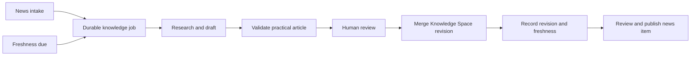

# News Development Graph

## Contract Scope

The Happyin news system schema 1.4 connects each reviewed news record to a
project or organization development thread and to an agent-readable Knowledge
Space resource. Schema 1.2 and 1.3 records remain valid and are not assigned
semantic branches retroactively.

Four repositories own separate stages:

| Repository | Owned state |
|---|---|
| `diffusion-love` | Private skeletons, provider runs, evidence, review decisions, export gate |
| `diffusion-love-news` | Public canonical items, JSON Schema, deterministic indexes |
| `diffusion-love-web` | Read-only feed, project, organization and item presentation |
| `knowledge-space` | Dense public implementation references and agent briefs |

The dependency direction is one-way: the private exporter emits a reviewed
public item, the public builder validates and materializes it, and both the
portal and agents consume the resulting public snapshot. The portal never
writes identity or graph state.

## Implementation Revisions

The public producer contract is fixed at
[`cd94753d11a86102df942f5560f1f49cdf332ccc`](https://github.com/AnastasiyaW/diffusion-love-news/commit/cd94753d11a86102df942f5560f1f49cdf332ccc).
That revision adds schema 1.4 validation, cross-record lineage checks,
project-thread aggregation and `_organizations.json` while leaving all 329
legacy canonical items semantically unchanged.

Portal source and deployment may be access-restricted, so this article does
not present them as publicly retrievable evidence. The consumer contract is
normative: a conforming consumer must validate the same identities and edges
fail-closed and must render news, project and organization routes from one
immutable producer snapshot.

## Public Entities

### Project

`project.family_slug` remains the stable project identity. Model versions and
adaptations stay inside the same family. Legacy project pages continue to use
`_projects.json`.

### Organization

`organization.slug` is the stable company or owner identity. A project item
may include both project and organization; their vendor slug and display name
must agree. Company-only news may use an anonymous project object but must keep
the organization identity.

### Development Thread

`development` contains:

```json
{
  "scope": "project",
  "thread_slug": "news-knowledge-graph",
  "thread_display": "News and knowledge graph",
  "predecessor_ids": ["n-0123456789"]
}
```

`scope` selects the project or organization on the same item. Predecessors are
reviewed continuation edges, not similarity results. The public builder checks
that each predecessor exists, is earlier in deterministic chronology, and has
the same subject and thread.

The builder materializes project `development_threads` and a separate
`_organizations.json`. This allows a project page to show parallel lines of
work and an organization page to join direct company milestones with its
explicitly owned projects.

## Knowledge Space Bridge

Every schema 1.4 item contains one reviewed `knowledge` object:

```json
{
  "title": "News Development Graph",
  "article_url": "https://happyin.space/architecture/news-development-graph/",
  "source_url": "https://raw.githubusercontent.com/AnastasiyaW/knowledge-space/FULL_COMMIT_SHA/docs/architecture/news-development-graph.md",
  "agent_context_url": "https://happyin.space/architecture/news-development-graph/#agent-brief"
}
```

The rendered page is stable navigation for people. `source_url` must pin a full
Git commit so an agent reads the same article that was reviewed with the news
record. `agent_context_url` points to the copy-ready instruction below.

This public agent brief is not a provider prompt. Internal enrichment prompts,
raw provider output and review notes remain private and are rejected
recursively by the public feed builder.

## Runtime Status

As of 2026-08-26, the reviewed public bridge is working for the first schema
1.4 item:

- the item belongs to the `diffusion-love` project development thread;
- its Knowledge Space Markdown is pinned to an immutable Git commit;
- the portal can render the project thread and article/Agent Brief actions;
- private enrichment runs, review decisions, and the public export are recorded.

The next maintenance loop is **designed but not yet implemented**. The current
private database has no Knowledge Space resource, refresh-job, article-check,
or revision tables. `FRESHNESS.md` defines domain-level review frequencies, but
the current freshness checker validates repository counts, wiki links, and
`llms.txt` synchronization rather than each article's last review date.

This distinction is operational: a linked immutable article proves what was
reviewed with one news item; it does not prove that an agent has since checked
the article for newer information.

## Target News-to-Knowledge Cycle

Every accepted schema-2 news intake will use a curator-owned Knowledge Space
resource reference and create one idempotent job in the same private database
transaction as the resource binding and news item. The final public
`knowledge` object is materialized only after an approved Knowledge Space
revision provides a full Git SHA. A calendar scheduler will create the same job
type when an article reaches its next-check date, so the workflow does not
depend on news continuing to arrive.



The job is the durable trigger. An MCP call, model conversation, or browser
session may end without losing the work.

The private ledger requires five kinds of state:

| Record | Responsibility |
|---|---|
| Knowledge resource | Stable project-or-organization/thread-to-article identity and current freshness projection |
| News binding | Exact item-to-resource and approved revision relationship |
| Knowledge job | News, scheduled, or manual trigger plus workflow status and dedupe key |
| Knowledge run | Append-only agent/provider attempt with hashes and evidence reference |
| Knowledge revision | Previous/new Git SHA, changed paths, reviewer, and merge receipt |

Resource identity is unique on `(subject_scope, subject_slug, thread_slug)`,
where `subject_scope` is `project` or `organization`. A news binding must match
the item's canonical development subject and thread. This lets company news
trigger the same cycle without pretending that the company is an intermediate
project.

A no-change review is still evidence. It updates `last_checked_at` and the next
check date but does not create an empty Git commit or change `last_changed_at`.
A failed run never advances freshness. Historical news items retain their old
commit-addressed source even after the live article receives a later scheduled
revision.

## Practical Use Contract

A news-linked knowledge page must tell an engineer or agent how to apply the
change, not only describe the announcement. The planned review gate requires:

1. what changed and which project or company development line it continues;
2. a runnable command, API call, workflow, or exact operating sequence;
3. when to use it and when not to use it;
4. versions, prerequisites, compatibility limits, and failure modes;
5. implementation details grounded in reviewed sources;
6. at least two concrete gotchas;
7. an Agent Brief and exact source revisions.

Models may draft these sections. They cannot choose canonical project/thread
identity, mark their own output reviewed, or publish a revision.

## MCP Boundary

MCP is useful here as a typed agent interface, but it is not the database,
scheduler, or workflow engine.

The minimum design uses two focused surfaces:

### Public `happyin-context`

A read-only, stateless Streamable HTTP server exposes commit-addressed news,
project, Knowledge Space, and freshness resources. Goal-oriented tools search
news/knowledge, assemble one project context, and build a compact agent context
for a news ID. Every result includes the exact producer and Knowledge Space
SHAs. It does not expose private review state or a generic fetch/shell tool.

### Private `happyin-curation`

The first writer is a local `stdio` server beside the Python pipeline, private
SQLite database, and Git worktrees. Typed tools can list work, queue an
idempotent refresh, prepare a draft, record a human review, apply an approved
Knowledge Space revision, compose a news candidate, and publish an approved
candidate. Apply/publish actions remain separately approval-gated.

Long work is identified by the domain `job_id`. The MCP Tasks extension may
mirror that job only when the server advertises the extension and the client
opts in through the capabilities in that request's `_meta`. The task handle is
stored durably and mapped to the domain job before it is returned; polling the
durable job remains the compatibility path. Cross-call state is explicit
rather than held in an invisible protocol session.

External webpages and provider responses are untrusted data. They may support
facts but cannot change permissions, identities, tool selection, or approval
state. Tool outputs are strict, bounded objects with evidence references and
named next valid actions.

For the first private connection, use Antigravity IDE with a workspace-local
`.agents/mcp_config.json`, or Antigravity CLI for the same local `stdio`
server. This keeps the curation process beside its SQLite database and Git
worktrees while connection logs remain inspectable. Antigravity is only the
MCP client; it does not own job state. Once the public read-only endpoint is
deployed, Antigravity 2.0, IDE, and CLI can all connect through its remote
`serverUrl`.

## Current Publication Sequence

Until the schema-2 target above is implemented, the working runtime remains
article-first:

1. Write and validate the Knowledge Space article.
2. Merge it and record the exact commit-addressed Markdown URL.
3. Ingest a news skeleton with project/organization, development and knowledge references.
4. Enrich only through an explicitly selected provider or a reviewed manual evidence run.
5. Compose and inspect the complete public candidate.
6. Record an explicit human review decision.
7. Export the canonical item and rebuild all generated public indexes.
8. Verify the exact producer commit, CI validation and authenticated portal routes.

Publishing the article alone does not publish a news item. Exporting a private
candidate alone does not update the public feed. A branch-addressed CDN response
is not proof of one coherent snapshot.

## Agent Brief

Copy this instruction to an agent together with the relevant Happyin news URL:

```text
Read the linked Happyin news item and this Knowledge Space article. Treat the
news item's project, organization, development thread, predecessor IDs and
commit-addressed knowledge source as the authoritative public graph. Explain:
1. what changed;
2. which project or company development line it continues;
3. how a user or agent can apply the changed capability, including prerequisites,
   an exact operating sequence and the main failure modes;
4. how the implementation works across the private pipeline, public builder,
   portal and Knowledge Space;
5. which claims are verified, reported or inferred;
6. the exact source revisions that support the answer.

Do not infer missing graph edges from similar titles, tags or embeddings. Do
not treat a mutable branch URL or a current live page as historical proof. If
the immutable source or referenced predecessor cannot be retrieved, state the
missing evidence instead of filling the gap.
```

## Validation Rules

- Identity slugs are lower-case kebab-case and are reviewed before export.
- One development thread belongs to exactly one project or organization.
- Cross-subject, cross-thread, missing and forward predecessor edges fail closed.
- Knowledge Markdown uses an immutable full Git commit URL.
- The public feed contains URLs to agent context, never internal prompt text.
- Derived JSON is rebuilt from item files and is not hand-edited.

## Gotchas

- **Similar news is not a continuation:** search and embeddings can suggest a
  candidate edge. **Fix:** publish only reviewer-approved predecessor IDs.
- **A company name is not identity:** spelling and branding changes create
  duplicate pages. **Fix:** use one canonical organization slug and reject
  conflicting metadata during aggregation.
- **A stable web page is not immutable input:** its contents may change after a
  news review. **Fix:** pair the page with commit-addressed Markdown.
- **Agent context can be confused with enrichment prompts:** relaxing privacy
  scans would expose internal data. **Fix:** keep internal prompt keys forbidden
  and publish only the reviewed article URLs.

## See Also

- [[happyin-knowledge-space]]
- [[architecture-documentation]]
- [[data-serialization-formats]]
- [[agent-architectures]]
- [[transactional-outbox]]
- [[function-calling]]

## Protocol References

- [MCP 2026-07-28 release](https://blog.modelcontextprotocol.io/posts/2026-07-28/)
- [MCP Tasks extension](https://github.com/modelcontextprotocol/modelcontextprotocol/blob/main/docs/extensions/tasks/overview.mdx)
- [Official MCP Python SDK v2](https://py.sdk.modelcontextprotocol.io/)
- [Cloudflare remote MCP guidance](https://developers.cloudflare.com/agents/model-context-protocol/guides/remote-mcp-server/)
- [OpenAI Agents SDK MCP integration](https://openai.github.io/openai-agents-python/mcp/)
- [Google Antigravity MCP configuration](https://antigravity.google/docs/mcp)
