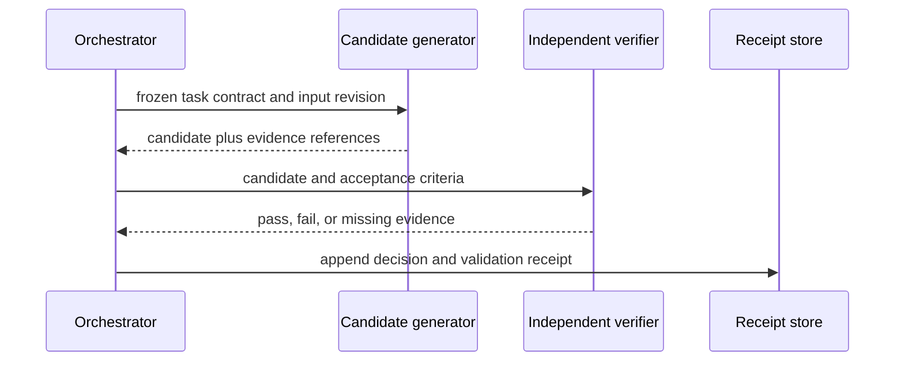
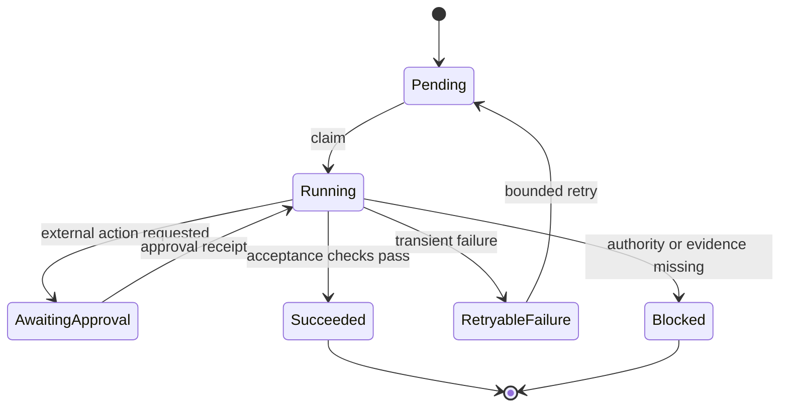

# Diagram-as-Code for Agent Workflows

**Scope checked: 2026-09-04.** A diagram is valuable when it makes an otherwise hidden state transition, handoff, approval, or trust boundary inspectable. Keep diagram source alongside the system it describes, but do not assume that one Markdown renderer, hosting site, or notation supports every diagram feature.

## Diagram the Unclear Boundary

Start with a concrete question rather than a diagram type:

| Question | Smallest useful diagram |
|---|---|
| Which role sends which artifact, and in what order? | sequence diagram |
| Which states can a task enter, retry, or terminally fail in? | state diagram |
| Which component may call which tool or service? | context or trust-boundary diagram |
| Which data crosses a permission, tenant, or network boundary? | data-flow or deployment diagram |
| Which policy controls a decision? | decision table, optionally paired with a state diagram |

Do not diagram a trivial helper only because a diagram tool is available. Prefer a plain test, contract, or short table when that communicates the behavior more directly.

## Sequence Diagram: Make Handoffs Visible

This Mermaid example captures a bounded review flow. It describes the intended protocol; the referenced code and tests must still prove that the protocol is implemented.

Sequence diagrams are effective when message order matters. They should name the artifact being handed off, not merely the agent label. Mermaid documents sequence-diagram syntax; PlantUML likewise treats textual participant and message definitions as source that a renderer turns into a diagram. [Mermaid sequence diagrams](https://mermaid.js.org/syntax/sequenceDiagram) · [PlantUML sequence diagrams](https://plantuml.com/sequence-diagram)

## State Diagram: Make Terminal States Explicit

For agents, a state diagram is often more useful than a large class diagram because retries, approvals, and terminal failure states are operationally important.

A terminal “blocked” state is not an error hidden behind a retry loop. It tells operators which evidence, approval, or external condition is required before work may resume. Validate exact state syntax against the renderer in your documentation pipeline. [Mermaid state diagrams](https://mermaid.js.org/syntax/stateDiagram.html) · [PlantUML state diagrams](https://plantuml.com/state-diagram)

## Keep a Trust Boundary Separate

A workflow diagram can imply permissions without showing them. Add a compact boundary view or table for decisions that involve credentials, user data, network calls, or publication.

| Boundary | Allowed flow | Required evidence |
|---|---|---|
| user input to planner | read as untrusted data | input record and policy version |
| planner to tool runner | only declared tool parameters | permission decision and tool receipt |
| tool runner to external service | approved, scoped request | idempotency key and service response |
| generated draft to publication | owner-approved content only | review and publish receipt |

The [C4 model](https://c4model.com/) is useful as a vocabulary for software context, containers, components, and code. It does not replace an explicit security review, and it does not choose a renderer for you.

## Select a Notation by the Publishing Contract

- **Mermaid:** use when its required syntax is supported by the actual documentation renderer and its CI validation.
- **PlantUML:** use when the project has a declared rendering path for PlantUML source or generated assets.
- **C4:** use for hierarchical architecture communication, independently of the diagram renderer selected.
- **UML terminology:** use only where its semantics help the team communicate; a formal-looking diagram is not a substitute for executable acceptance criteria.

Check current official syntax before relying on a feature, and avoid publishing claims such as “native everywhere” or a fixed count of supported diagram types. Renderers, plugins, and hosting integrations evolve independently.

## Verification Workflow

1. keep source with the relevant specification or code revision;
2. name the target renderer and the command that validates it;
3. render in the same CI or static-site path that publishes the page;
4. inspect failures as documentation defects, not as cosmetic warnings;
5. update the diagram whenever a tested state, message, or trust boundary changes.

For a high-risk flow, pair the diagram with a state-machine test, API contract, or approval-policy test. The diagram helps people reason about the system; the executable check decides whether a revision preserves the contract.

## Common Failure Modes

- **Renderer assumption:** a valid source file is mistaken for proof that the published site can render it.
- **Happy-path-only flow:** retries, cancellation, denial, and terminal blockage disappear from the diagram.
- **Implicit authority:** arrows imply that an agent may call a system without showing the approval boundary.
- **Diagram drift:** the picture survives a code change because no validation or review links it to the revision.
- **Notation worship:** a complex diagram hides a simpler acceptance test or decision table.

## References

- [Mermaid sequence-diagram syntax](https://mermaid.js.org/syntax/sequenceDiagram)
- [Mermaid state-diagram syntax](https://mermaid.js.org/syntax/stateDiagram.html)
- [PlantUML sequence-diagram documentation](https://plantuml.com/sequence-diagram)
- [PlantUML state-diagram documentation](https://plantuml.com/state-diagram)
- [C4 model](https://c4model.com/)
